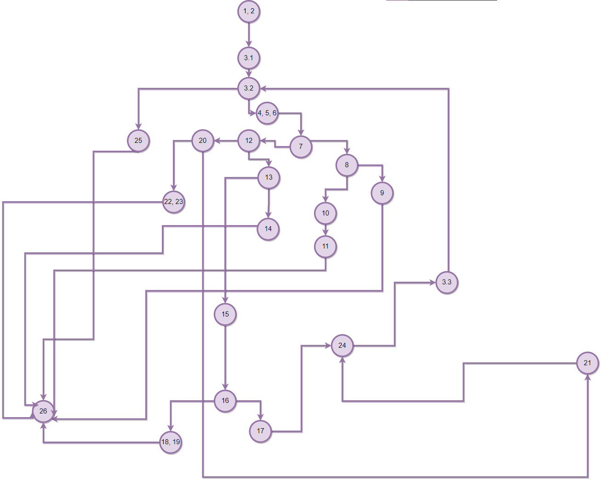
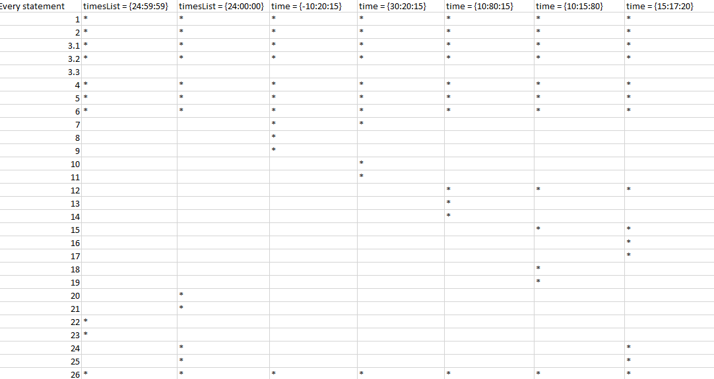
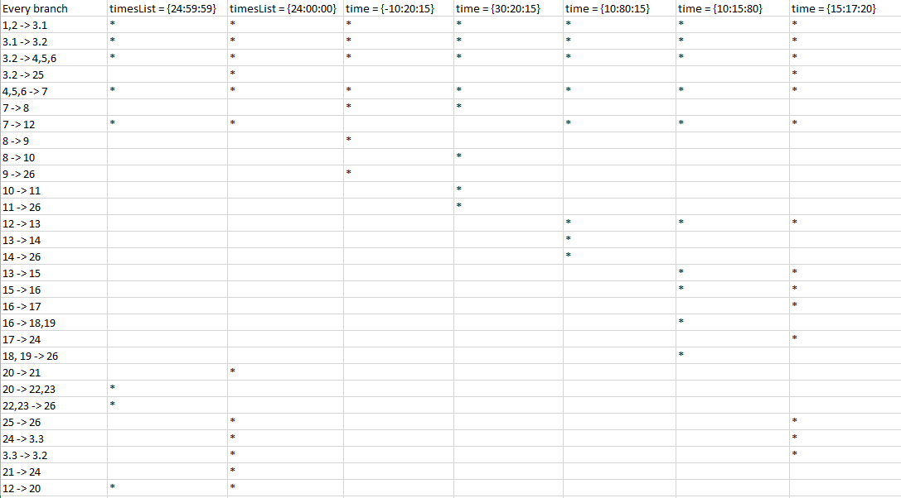

# Втора лабораториска вежба по Софтверско инженерство

## Филип Филипоски, бр. на индекс 196005

### Control Flow Graph

### Цикломатска комплексност
Цикломатската комплесност е 8. Постојат 29 ребра  и 23 јазли и поради тоа комплексноста е 8 (29 - 23 = 6 , 6 + 2 = 8).

### Тест случаи според критериумот Every statement

### Тест случаи според критериумот Every path

### Објаснување на напишаните unit tests

Every statement ги поминува сите statements со try catch и assertEquals. Every path ги поминува сите можни патеки со exceptions и equals.
